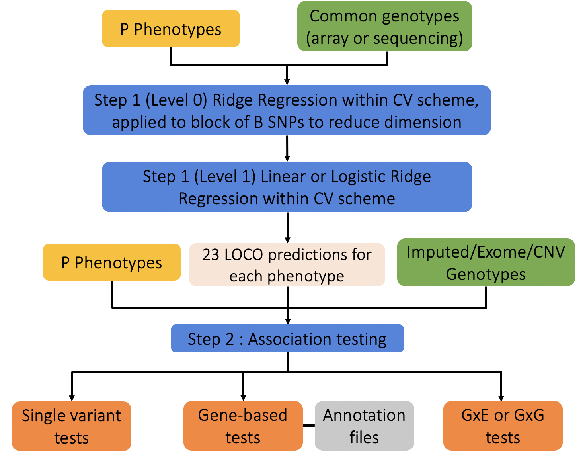

## Overview 

This page provides an overview of the models and methods implemented in
**regenie**. A full description is given in our [paper](https://doi.org/10.1038/s41588-021-00870-7).

**regenie** carries out genome-wide association tests for both
  quantitative and binary (case-control) phenotypes. Starting at **regenie v4.0**, it also supports survival analysis for time-to-event data (See Survival analysis section below). It is designed to handle

1. A large number of samples. For example, it is ideally suited to the
[UK Biobank](https://www.ukbiobank.ac.uk/) dataset with 500,000 samples.
2. A combination of genetic data from a micro-array, imputation and
exome sequencing.
3. A large number of either quantitative traits (QTs) or binary
(case-control) traits (BTs)
4. Accounting for a set of covariates

An overview of the **regenie** method is provided in the figure below.
Essentially, **regenie** is run in 2 steps:

1. In the first step a subset of genetic markers are used to fit a
whole genome regression model that captures a good fraction of the
phenotype variance attributable to genetic effects.
2. In the second step, a larger set of genetic markers (e.g. imputed
markers) are tested for association with the phenotype *conditional
upon* the prediction from the regression model in Step 1, using a
leave one chromosome out (LOCO) scheme, that avoids proximal
contamination.

{ style="text-align:center;padding: 10px;width:70%;border: 1px solid #ddd;display: block;margin-left: auto;margin-right: auto"}
 

### Step 1 : Whole genome model

In Step 1 a whole genome regression model is fit at a subset of the
total set of available genetic markers. These are typically a set of
several hundred thousand (\(M\)) common markers from a micro-array. 

#### Ridge regression (level 0)

**regenie** reads in the \(M\) markers in blocks of \(B\) consecutive markers (`--bsize` option).

In each block, a set of ridge regression
  predictors are calculated for a small range of \(J\) shrinkage
  parameters \( \{\tau_1,\ldots, \tau_J\} \) (using `--l0` option [default is 5]) .

For a block of SNPs in a \(N\times B\) matrix \(X\) and \(N\times 1\)
phenotype vector \(Y\) we calculate  \(J\)  predictors

\( X\widehat{\beta}_1 \ldots, X\widehat{\beta}_J \) 

where

\( \widehat{\beta}_j = (X^TX+\tau_j I)^{-1}X^T Y\) 

The idea behind using a range of shrinkage
  values is to capture the unknown number and size of truly
  associated genetic markers within each window. The ridge regression takes account of Linkage disequilibrium (LD) within each block.

These predictors are stored in place of the
  genetic markers in matrix \(W\), providing a large reduction in data size. 
For example, if
  \(M=500,000\) and \(B=1,000\) and \(J=5\) shrinkage parameters are used, then the
  reduced dataset will have \(JM/B=2,500\) predictors.

Ridge regression is used in this step for both quantitative and binary
traits. 

#### Cross-validation (level 1)

The predictors generated by the ridge regression step will all be
positively correlated with the phenotype. Thus, it is important to
account for that correlation when building a whole genome wide
regression model.

When analyzing a quantitative trait we use a second level of ridge
regression on the full set of \(JM/B\) predictors in \(W\). This
approach is inspired by the method of stacked regressions[@RN293].

We fit the ridge regression for a range of shrinkage parameters (`--l1` option) and choose a single
best value using K-fold cross validation scheme. This assesses the
predictive performance of the model using held out sets of data, and aims to control
any over-fitting induced by using the first level of ridge regression
to derive the predictors.

In other words, we fit the model

$$Y = W\alpha + \epsilon$$

where \(\alpha\) is estimated as \(\widehat{\alpha} = (W^TW + \phi\,I)^{-1}W^TY\)
and the parameter \(\phi\) is chosen
via K-fold cross-validation. 

For binary traits, we use a logistic ridge regression model to combine
the predictors in \(W\)

$$\text{logit}(p) = \mu + W\alpha$$
where \(p\) is the probability of being a case and \(\mu\) captures the effects of non-genetic covariates.

#### Genetic predictors and LOCO

Once \(\alpha\) has been estimated we can construct the genetic prediction

$$Z = W\widehat{\alpha}$$

Also, since each column of the matrix \(W\) will be associated with a
chromosome we can can also construct a genetic prediction ignoring any
one chromosome, by simply ignoring those columns when calculating the
prediction. This is known as the Leave One Chromosome Out (LOCO)
approach. These LOCO predictions are valuable at Step 2 of **regenie**
when each marker is tested for associated (see below).

For binary traits, it is the linear predictor in a logistic regression
model using LOCO that is saved,
and used as an offset when fitting logistic regression models to test
for association.

#### Multiple phenotypes

The dimension reduction step using ridge regression can be used very
efficiently to model multiple phenotypes at once. The ridge regression
equations for a block of SNPs in a \(N\times B\) matrix \(X\) and a single phenotype
in a \(N\times 1\) matrix \(Y\) take the form

\( \widehat{\beta} = AY \) where \(A = (X^TX+\tau I)^{-1}X^T\) **does not depend on \(Y\)**

If instead \(P\) phenotypes are stored in columns of a \(N\times P\) matrix \(Y\), then the matrix \(A\)
can be applied jointly to calculate the matrix of estimates \(\widehat{\beta} = AY\),
and this can take advantage of parallel linear algebra
implementations in the Eigen matrix library.

#### Covariates

Covariates, such as age and sex and batch effect variables can be
included in the **regenie** model.

For quantitative traits, any covariates are regressed out of
phenotypes and genotypes before fitting the model.

For binary traits, we fit a null model with only covariates, and use
predictions from that model as an offset when fitting the logistic
regression model.

### Step 2 : Single-variant association testing

In Step 2, a larger set of markers are tested for association with the
trait (or traits). As with Step 1, these markers are also read in
blocks of \(B\) markers, and tested for association. This avoids having
to have all markers stored in memory at once.

#### Quantitative traits

For quantitative traits, we use a linear regression model for
association testing.

- Covariates are regressed out of the phenotypes and genetic markers.
- The LOCO predictions from Step 1 are removed from the phenotypes.
- Linear regression is then used to test association of the residualized
phenotype and the genetic marker.
- Parallel linear algebra operations in the Eigen library are used
  where possible.

#### Binary traits

For binary traits, logistic regression score test is used to test association of
the phenotype and the genetic marker.

The logistic regression model includes the LOCO predictions from
  Step 1 *as an offset*. Covariates are included in the linear
  predictor in the usual way.

When the case-control ratio is imbalanced, standard association tests
don't control Type I error well at rare genetic markers. **regenie**
has two options to handle this

##### Firth logistic regression

Standard maximum likelihood estimates are generally biased. The Firth
correction[@RN248]
removes much of the bias, and results in better calibrated test
statistics. The correction involves adding a penalty term to the
log-likelihood,

$$ \widetilde{l}(\theta) = l(\theta) + {1 \over 2} \log I|\theta| $$

where the penalty term corresponds to the use of Jeffrey's Prior. 
This prior has the effect of shrinking the effect size towards zero.

**regenie** uses a Firth correction when the p-value from the standard
  logistic regression test is below a threshold (default 0.05). 
It also includes a novel, accurate and fast approximate Firth correction which 
is ~60x faster than the exact Firth correction
(see the option `--firth`). 

The p-value reported in **regenie** is based on a likelihood ratio test (LRT), and we use the Hessian of the log-likelihood without the penalty term to estimate the standard error (SE). 
This may cause an issue in meta-analyses with rare variants, as the effect size estimate and SE may not match with the LRT p-value. 
Hence, we added an option `--firth-se` to report a SE computed instead from the effect size estimate and the LRT p-value.

##### Saddle point approxiation (SPA) test

The SPA test approximates the null distribution of the test statistic
by approximating the cumulant generating function of the
test  statistic,  which  involves  all  of  the  higher  order
moments[@RN488]$^,$[@RN245]. This provides a better estimation of the tail probabilities compared to using
standard asymptotic theory which relies on the normal approximation and uses only the
first two moments of the dsitribution. A tail probability is obtained as 

$$  
\begin{align*}  
P&(T < t_{\text{obs}}) \approx
    \Phi(z), \text{ where,}\\
    z &= w + \frac{1}{w}\log{\frac{v}{w}}\\
    w &= \text{sign}(\delta^*)\sqrt{ 2 [ t_{\text{obs}}\, \delta^* - K(\delta^*)}],\,
    v = \delta^*\sqrt{K''(\delta^*)}
\end{align*}
$$

and \(K(\delta)\) is the cumulant generating function of the test statistic and \(\delta^*\) 
is obtained by using a root-finding algorithm for \(K'(\delta)=t_{\text{obs}}\). As this approximation
has been found not to work very well for ultra-rare variants, a minimum minor 
allele count (MAC) is used to filter out these variants before testing (option `--minMAC`).

### Step 2 : Gene-based testing

Instead of performing single-variant association tests, multiple variants can be aggregated
in a given region, such as a gene, using the following model

$$g(\mu) = w_1G_1\beta_1 + \dots + w_mG_m\beta_m$$

where \(G_i\)'s represent the single variants included in the test,
\(w_i\)'s and \(\beta_i\)'s are weights and effect sizes, respectively, for each variant,
and \(g(.)\) is a link function for the phenotypic mean \(\mu\). 
We also denote by \(S_i\) the score statistics obtained from the 
[single-variant tests](#step-2-single-variant-association-testing).
This can be especially helpful when testing rare variants as single-variant 
tests usually have lower power performance.

To avoid inflation in the gene-based tests due to rare variants as well as reduce computation time, we have implemented the collapsing approach
proposed in SAIGE-GENE+[@RN492], where ultra-rare variants are aggregated into a mask.
For highly imbalanced binary traits, SPA/Firth correction can be used to calibrate the test statistics in the
gene-based tests as proposed in Zhao et al. (2020)[@RN452] using `--firth/--spa`. 

#### Burden tests
Burden tests, as defined in Lee et al. (2014)[@RN487], assume \(\beta_i=\beta\; \forall i\), where \(\beta\) is a fixed coefficient, which then leads to the test statistic
$$Q_{BURDEN} = \left(\sum_i w_iS_i\right)^2$$
These tests collapse variants into a single variable which is then tested for association with the phenotype. Hence, they are more powerful when variants have effects in the same direction and of similar magnitude. 
In **regenie**, multiple options are available to aggregate variants together into a burden mask beyond the linear combination above ([see here](../options/#options_1)). 
For example, the burden tests that were employed in Backman et al. (2021)[@RN457]
use the default strategy in **regenie** of collapsing variants by taking
the maximum number of rare alleles across the sites.

#### Variance component tests
Unlike burden tests, SKAT[@RN386] assume the effect sizes $\beta_i$ come from an arbitrary
distribution with mean 0 and variance $\tau^2$ which leads to the test statistic
$$Q_{SKAT} = \sum_i w_i^2S_i^2$$
Hence, SKAT can remain powerful when variant effects are in opposite directions.

The omnibus test SKATO[@RN454] combines the SKAT and burden tests as 
$$Q_{SKATO} = \rho Q_{BURDEN} + (1-\rho) Q_{SKAT}$$
So setting $\rho=0$ corresponds to SKAT and $\rho=1$ to the burden test.
In practice, the parameter $\rho$ is chosen to maximize the power 
[**regenie** uses a default grid of 8 values {$0, 0.1^2, 0.2^2, 0.3^2, 0.4^2, 0.5^2, 0.5, 1$}
and set the weights $w_i = Beta(MAF_i,1,25)$].

To obtain the p-value from a linear combination of chi-squared variables, **regenie** uses Davies' exact method[@RN524] by default.
Following Wu et al (2016)[@RN514], **regenie** uses Kuonen's saddlepoint approximation method[@RN526] when the Davies' p-value
is below 1e-5 and if that fails, it uses Davies' method with more stringent convergence parameters (lim=1e5,acc=1e-9). 

The original SKATO method uses numerical integration when maximizing power across the 
various SKATO models that use different values for $\rho$. 
We also implement a modification of SKATO, named SKATO-ACAT, 
which instead uses the Cauchy combination method[@RN482] 
to combine the p-values from the different SKATO models.

#### Cauchy combination tests
The ACATV[@RN339] test uses the Cauchy combination method ACAT to combine single variant p-values $p_i$ as
$$Q_{ACATV} = \sum_i \widetilde{w}_i^2\tan{\{\pi(0.5 - p_i)\}}$$
where we set $\widetilde{w}_i = w_i \sqrt{MAF(1-MAF)}$. 
This test is highly computationally tractable and is robust to correlation between the single variant tests.

The omnibus test ACATO[@RN339] combines ACATV with the SKAT and burden tests as 
$$
Q_{ACATO} = 
\frac{1}{3}\tan{\{\pi(0.5 - p_{ACATV})\}}+
\frac{1}{3}\tan{\{\pi(0.5 - p_{Burden})\}}+
\frac{1}{3}\tan{\{\pi(0.5 - p_{SKAT})\}}
$$

where unlike the original ACATO test, we only use one set of the weights $w_i$.
Alternatively, we augment the test to include an extended set of SKATO models beyond SKAT and Burden
(which correspond to $\rho$ of 0 and 1 in SKATO respectively) and use the default SKATO grid of 8 values for $\rho$.

#### Sparse Burden Association Test
**regenie** can generate burden masks which are obtained by aggregating single variants
using various annotation classes as well as allele frequency
thresholds. The Sparse Burden Association Test (SBAT)[@RN629] combines these burden masks
in a joint model imposing constraints of same direction of effects
$$
\mu = \sum_{\text{mask }i} M_i\gamma_i
$$
where $M_i$ represent a burden mask and we solve
$$
\underset{\boldsymbol\gamma}{\min} || Y - \sum_i M_i\gamma_i||^2 
\text{ subject to } \gamma_i \ge 0 \text{ for all } i
$$

The SBAT method tests the hypothesis $H_0: \gamma_i=0$ for all $i$ vs.
$H_1: \gamma_i > 0$ for some $i$.
By using this joint model, the SBAT test accounts for the correlation structure between the burden masks 
and with the non-negative constraints,
it can lead to boost in power performance when multiple burden masks are causal and have concordant effects.
This test has the nice property that it combines 
model selection of the masks (via the sparsity induced by the non-negative assumption) 
with model inference (it is well calibrated and powerful).

#### GENE_P
As the different gene-based tests in REGENIE can be more powerful under different genetic architectures,
we propose a unified strategy, named GENE_P, that combines the strengths of these tests.
It uses ACAT to combine the p-values of the SKATO, ACATV, Burden and SBAT tests 
and obtain an overall assessment of significance for a genetic region (e.g. gene).
The diagram below illustrates the GENE_P test using 4 masks (i.e. combination of variant annotations) and 3 allele frequency cutoffs 
when performing gene-based tests.

{ style="text-align:center;padding: 10px;width:70%;border: 1px solid #ddd;display: block;margin-left: auto;margin-right: auto"}
 

### Step 2 : Interaction testing

The GxE tests are of the form
$$
g(\mu) = E\alpha + G\beta + (G\odot E)\gamma
$$
where $E$ is an environmental risk factor and $G$ is a marker of interest,
and $\odot$ represents the Haddamard (entry-wise) product of the two.
The last term in the model allows for the variant to have different effects across values of the risk factor. 
*Note: if $E$ is categorical, we use a dummy variable for each level of $E$ in the model above.*

We can look at the following hypotheses:

0. $H_0: \beta = 0$ given $\gamma = 0$, which is a marginal test for the SNP
1. $H_0: \beta = 0$, which is a test for the main effect of the SNP in the full model
2. $H_0: \gamma = 0$, which is a test for interaction
3. $H_0: \beta = \gamma = 0$, which tests both main and interaction effects for the SNP

Misspecification of the model above, 
such as in the presence of heteroskedasticity, or 
the presence of high case-control imbalance can lead to inflation in the tests.
Robust (sandwich) standard error (SE) estimators[@RN485] can be used to adress model misspecification however, 
they can suffer from inflation when testing rare variants
or in the presence of high case-control imbalance[@RN373]$^,$[@RN320].

In **regenie**, we use a hybrid approach which combines:

* Wald test with sandwich estimators
* Wald test with heteroskedastic linear models (for quantitative traits)
* LRT with penalized Firth regression (for binary traits)

For quantitative traits,
we use the sandwich estimators HC3 to perform a Wald test for variants whose minor allele count (MAC) is above 1000 (see `--rare-mac`). 
For the remaining variants, we fit a heteroskedastic linear model (HLM)[@RN417]
$$
Y = E\alpha + E^2\zeta + G\beta + (G\odot E)\gamma + \epsilon
$$

where we assume $\epsilon \sim N(0, D)$ where $D$ is a diagonal matrix with entries $\sigma^2\exp{(1 + E\theta_1 + E^2\theta_2)}$.
This formulation allows for the phenotypic variance to also depend on the risk factor $E$.
By incorporating both the linear and quadratic effect of $E$ in the mean and variance of $Y$, 
this model provides robustness to heteroskedasticity 
(*Note: the $E^2$ terms are only added when $E$ is quantitative*). 
Wald tests are then performed for the null hypotheses listed above.

For binary traits, we consider the following interaction model
$$
\text{logit}(\mu) = E\alpha + E^2\zeta + G\beta + (G\odot E)\gamma
$$
where we also include a non-linear effect for $E$ (not if categorical).
The sandwich estimator HC3 is used in a Wald test for variants whose MAC is above 1000 (see `--rare-mac`) otherwise the model-based standard errors are used.
When Firth is specified, we only apply the Firth correction using LRT if the p-value for the interaction term $\gamma$ from the Wald test is below a specified threshold (see `--pThresh`). So the added $E^2$ term as well as the use of the Firth penalty 
help with case-control imbalance and model misspecification for the effect of $E$ on the phenotype. 

### Survival analysis

Starting with **regenie v4.0**, we have enabled the survival analysis, improving the power for analyzing common diseases where time-to-event data is available. REGENIE utilizes the Cox Proportional Harzard model for association testing. We assume that samples without an event are right-censored, i.e. the survival time is only known to be greater than a certain value. The user needs to encode this into the phenotypes.

#### Step 1: Whole genome model using cox ridge regression

In step 1, Level 0 is the same as the section above. We use linear ridge regression with `time` as the response to reduce dimensionality. In Level 1, instead of linear/logistic ridge regression, we use Cox Ridge regression[simon2011regularization] to combine the predictions $W$ from Level 0.

$$
\lambda_i(t) = \lambda_0(t) \exp(\mu_i + w_i^\intercal \alpha)
$$
where $\lambda(t)$ is the hazard function, $\mu$ captures the effects of non-genetic covariates.

We fit the cox ridge regression for a range of shrinkage parameters and select the best value using K-fold cross validation scheme.

With the estimated $\hat{\alpha}$, we construct Leave One Chromosome Out genetic prediction. These LOCO predictions capture population structure, relatedness and polygenic effects.

#### Step 2: Single variant and gene-based burden tests

For time-to-event traits, the cox proportional hazard regression model is used to test the association between the phenotype and the genetic marker. **Note**: the only supported gene-based test is the burden test.

The cox proportional hazard regression model includes the LOCO predictions from Step 1 as an offset.

$$
\lambda_i(t) = \lambda_0(t) \exp(\mu_i + w_{i, LOCO} + g_i \beta)
$$

We test the null hypothesis $H_0: \beta = 0$ using the score test. When the event rate is low, the standard score test doesn't control Type I error well at rare genetic markers. To reduce the bias and achieve a more robust test, regenie uses Firth correction[heinze2001solution] when the p-value from the standard score test is below a threshold (default 0.05). 

The firth correction provides a well-calibrated test, but comes with a computational cost. To mitigate this burden in Cox regression, we include a fast approximate test, which gives results very similar to the exact Firth test.

### Missing Phenotype data

With QTs, missing values are mean-imputed in Step 1 and they are 
dropped when testing each phenotype in Step 2 (unless using `--force-impute`).

With BTs, missing values are mean-imputed in Step 1 when fitting the
level 0 linear ridge regression and they are dropped when fitting the
level 1 logistic ridge regression for each trait. In Step 2, missing 
values are dropped when testing each trait.

To remove all samples that have missing values at **any** of the \(P\)
phenotypes from the analysis, use option `--strict` in step 1 and 2. 
This can also be used when analyzing a single trait to only keep individuals with 
complete data by setting the phenotype values of individuals to remove to NA.

Note: imputation is only applied to phenotypes; covariates are not allowed to have missing data.

### References

\bibliography
