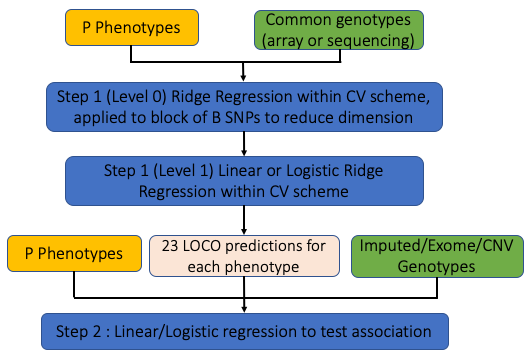

## Overview 

This page provides an overview of the models and methods implemented in
**regenie**. A full description is given in our 
 [BioRxiv pre-print](https://www.biorxiv.org/content/10.1101/2020.06.19.162354v1).

**regenie** carries out genome-wide association tests for both
  quantitative and binary (case-control) phenotypes. It is designed to handle

1. A large number of samples. For example, it is ideally suited to the
[UK Biobank](https://www.ukbiobank.ac.uk/) dataset with 500,000 samples.
2. A combination of genetic data from a micro-array, imputation and
exome sequencing.
3. A large number of either quantitative traits (QTs) or binary
(case-control) traits (BTs)
4. Accounting for a set of covariates

An overview of the **regenie** method is provided in the figure below.
Essentially, **regenie** is run in 2 steps:

1. In the first step a subset of genetic markers are used to fit a
whole genome regression model that captures a good fraction of the
phenotype variance attributable to genetic effects.
2. In the second step, a larger set of genetic markers (e.g. imputed
markers) are tested for association with the phenotype *conditional
upon* the prediction from the regression model in Step 1, using a
leave one chromosome out (LOCO) scheme, that avoids proximal
contamination.

{ style="text-align:center;padding: 10px;width:70%;border: 1px solid #ddd;display: block;margin-left: auto;margin-right: auto"}
 

### Step 1 : Whole genome model

In Step 1 a whole genome regression model is fit at a subset of the
total set of available genetic markers. These are typically a set of
several hundred thousand (\(M\)) common markers from a micro-array. 

#### Ridge regression (level 0)

**regenie** reads in the \(M\) markers in blocks of \(B\) consecutive markers (`--bsize` option).

In each block, a set of ridge regression
  predictors are calculated for a small range of \(J\) shrinkage
  parameters \( \{\tau_1,\ldots, \tau_J\} \) (using `--l0` option [default is 5]) .

For a block of SNPs in a \(N\times B\) matrix \(X\) and \(N\times 1\)
phenotype vector \(Y\) we calculate  \(J\)  predictors

\( X\widehat{\beta}_1 \ldots, X\widehat{\beta}_J \) 

where

\( \widehat{\beta}_j = (X^TX+\tau_j I)^{-1}X^T Y\) 

The idea behind using a range of shrinkage
  values is to capture the unknown number and size of truly
  associated genetic markers within each window. The ridge regression takes account of Linkage disequilibrium (LD) within each block.

These predictors are stored in place of the
  genetic markers in matrix \(W\), providing a large reduction in data size. 
For example, if
  \(M=500,000\) and \(B=1,000\) and \(J=5\) shrinkage parameters are used, then the
  reduced dataset will have \(JM/B=2,500\) predictors.

Ridge regression is used in this step for both quantitative and binary
traits. 

#### Cross-validation (level 1)

The predictors generated by the ridge regression step will all be
positively correlated with the phenotype. Thus, it is important to
account for that correlation when building a whole genome wide
regression model.

When analyzing a quantitative trait we use a second level of ridge
regression on the full set of \(JM/B\) predictors in \(W\). This
approach is inspired by the method of stacked regressions [1].

We fit the ridge regression for a range of shrinkage parameters (`--l1` option) and choose a single
best value using K-fold cross validation scheme. This assesses the
predictive performance of the model using held out sets of data, and aims to control
any over-fitting induced by using the first level of ridge regression
to derive the predictors.

In other words, we fit the model

$$Y = W\alpha + \epsilon$$

where \(\alpha\) is estimated as \(\widehat{\alpha} = (W^TW + \phi\,I)^{-1}W^TY\)
and the parameter \(\phi\) is chosen
via K-fold cross-validation. 

For binary traits, we use a logistic ridge regression model to combine
the predictors in \(W\)

$$\text{logit}(p) = \mu + W\alpha$$
where \(p\) is the probability of being a case and \(\mu\) captures the effects of non-genetic covariates.

#### Genetic predictors and LOCO

Once \(\alpha\) has been estimated we can construct the genetic prediction

$$Z = W\widehat{\alpha}$$

Also, since each column of the matrix \(W\) will be associated with a
chromosome we can can also construct a genetic prediction ignoring any
one chromosome, by simply ignoring those columns when calculating the
prediction. This is known as the Leave One Chromosome Out (LOCO)
approach. These LOCO predictions are valuable at Step 2 of **regenie**
when each marker is tested for associated (see below).

For binary traits, it is the linear predictor in a logistic regression
model using LOCO that is saved,
and used as an offset when fitting logistic regression models to test
for association.

#### Multiple phenotypes

The dimension reduction step using ridge regression can be used very
efficiently to model multiple phenotypes at once. The ridge regression
equations for a block of SNPs in a \(N\times B\) matrix \(X\) and a single phenotype
in a \(N\times 1\) matrix \(Y\) take the form

\( \widehat{\beta} = AY \) where \(A = (X^TX+\tau I)^{-1}X^T\) **does not depend on \(Y\)**

If instead \(P\) phenotypes are stored in columns of a \(N\times P\) matrix \(Y\), then the matrix \(A\)
can be applied jointly to calculate the matrix of estimates \(\widehat{\beta} = AY\),
and this can take advantage of parallel linear algebra
implementations in the Eigen matrix library.

#### Covariates

Covariates, such as age and sex and batch effect variables can be
included in the **regenie** model.

For quantitative traits, any covariates are regressed out of
phenotypes and genotypes before fitting the model.

For binary traits, we fit a null model with only covariates, and use
predictions from that model as an offset when fitting the logistic
regression model.

### Step 2 : Association testing

In Step 2 a larger set of markers are tested for association with the
trait (or traits). As with Step 1, these markers are also read in
blocks of \(B\) markers, and tested for association. This avoids having
to have all markers stored in memory at once.

#### Quantitative traits

For quantitative traits, we use a linear regression model for
association testing.

- Covariates are regressed out of the phenotypes and genetic markers.
- The LOCO predictions from Step 1 are removed from the phenotypes.
- Linear regression is then used to test association of the residualized
phenotype and the genetic marker.
- Parallel linear algebra operations in the Eigen library are used
  where possible.

#### Binary traits

For binary traits, logistic regression score test is used to test association of
the phenotype and the genetic marker.

The logistic regression model includes the LOCO predictions from
  Step 1 *as an offset*. Covariates are included in the linear
  predictor in the usual way.

When the case-control ratio is imbalanced, standard association tests
don't control Type I error well at rare genetic markers. **regenie**
has two options to handle this

##### Firth logistic regression

Standard maximum likelihood estimates are generally biased. The Firth
correction [2]
removes much of the bias, and results in better calibrated test
statistics. The correction involves adding a penalty term to the
log-likelihood,

$$ \widetilde{l}(\theta) = l(\theta) + {1 \over 2} \log I|\theta| $$

where the penalty term corresponds to the use of Jeffrey's Prior. 
This prior has the effect of shrinking the effect size towards zero.

**regenie** uses a Firth correction when the p-value from the standard
  logistic regression test is below a threshold (default 0.05). 
It also includes a novel, accurate and fast approximate Firth correction which 
is ~60x faster than the exact Firth correction
(see the option `--firth`). 

The p-value reported in **regenie** is based on a likelihood ratio test (LRT), and we use the Hessian of the log-likelihood without the penalty term to estimate the standard error (SE). 
This may cause an issue in meta-analyses with rare variants, as the effect size estimate and SE may not match with the LRT p-value. 
Hence, we added an option `--firth-se` to report a SE computed instead from the effect size estimate and the LRT p-value.

##### Saddle point approxiation (SPA) test

The SPA test approximates the null distribution of the test statistic
by approximating the cumulant generating function of the
test  statistic,  which  involves  all  of  the  higher  order
moments [3,4]. This provides a better estimation of the tail probabilities compared to using
standard asymptotic theory which relies on the normal approximation and uses only the
first two moments of the dsitribution. A tail probability is obtained as 

$$  
\begin{align*}  
P&(T < t_{\text{obs}}) \approx
    \Phi(z), \text{ where,}\\
    z &= w + \frac{1}{w}\log{\frac{v}{w}}\\
    w &= \text{sign}(\delta^*)\sqrt{ 2 [ t_{\text{obs}}\, \delta^* - K(\delta^*)}],\,
    v = \delta^*\sqrt{K''(\delta^*)}
\end{align*}
$$

and \(K(\delta)\) is the cumulant generating function of the test statistic and \(\delta^*\) 
is obtained by using a root-finding algorithm for \(K'(\delta)=t_{\text{obs}}\). As this approximation
has been found not to work very well for ultra-rare variants, a minimum minor 
allele count (MAC) is used to filter out these variants before testing (option `--minMAC`).

### Missing Phenotype data

With QTs, missing values are mean-imputed in Step 1 and they are 
dropped when testing each phenotype in Step 2 (unless using `--force-impute`).

With BTs, missing values are mean-imputed in Step 1 when fitting the
level 0 linear ridge regression and they are dropped when fitting the
level 1 logistic ridge regression for each trait. In Step 2, missing 
values are dropped when testing each trait.

To remove all samples that have missing values at **any** of the \(P\)
phenotypes from the analysis, use option `--strict` in step 1 and 2. 
This can also be used when analyzing a single trait to only keep individuals with 
complete data by setting the phenotype values of individuals to remove to NA.

Note: imputation is only applied to phenotypes; covariates are not allowed to have missing data.

### References

[1] L. Breiman (1996) Stacked Regressions. Machine Learning, 24,
49-64.

[2] D. Firth (1993) Bias reduction of maximum likelihood estimates. Biometrika 80,  27–38.

[3] R. Butler (2007) Saddlepoint Approximations with Applications. Cambridge University Press.

[4] R. Dey et al. (2017) A Fast and Accurate Algorithm to Test for Binary
Phenotypes and Its Application to PheWAS.The American Journal of Human
Genetics 101, 37–49.
