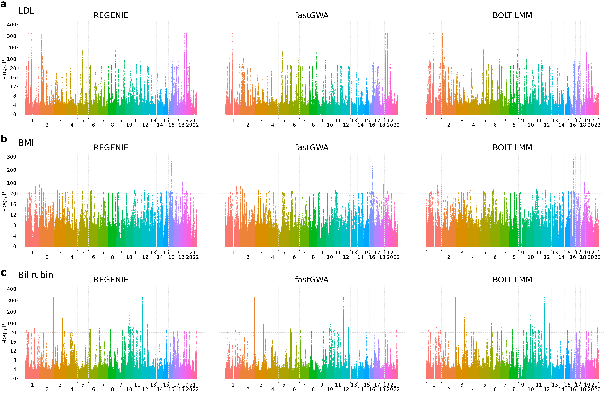
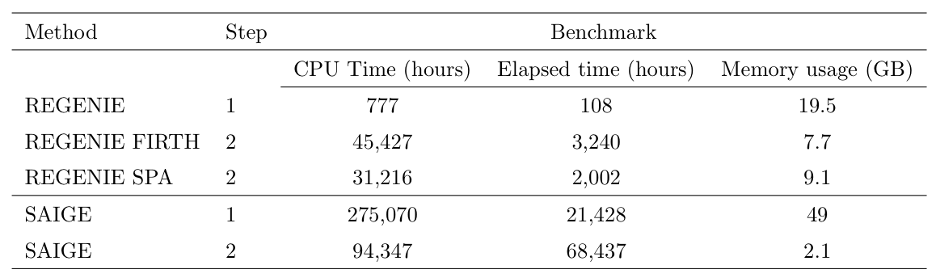
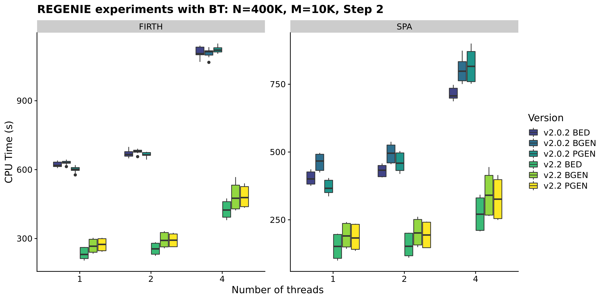
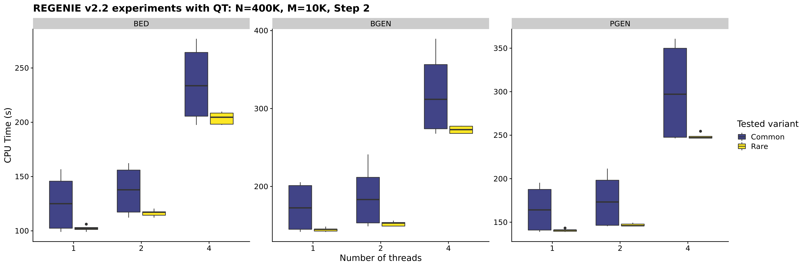

## Performance

We assessed the performance of **regenie** against 3 other
programs for GWAS on large cohorts.

1. BOLT-LMM [Loh et al. (2015) Nature Genetics 47, 284–290](https://www.nature.com/articles/ng.3190) [[Software]](https://data.broadinstitute.org/alkesgroup/BOLT-LMM/)
2. SAIGE - [Zhou et al. (2018) Nature Genetics 50, 1335–1341](https://www.nature.com/articles/s41588-018-0184-y)[[Software]](https://github.com/weizhouUMICH/SAIGE)
3. fastGWA - [Jiang et al. (2019) Nature Genetics 51, 1749–1755](https://www.nature.com/articles/s41588-019-0530-8) [[Software]](https://cnsgenomics.com/software/gcta/#Overview)

Full details for all the runs are available in our [paper](https://doi.org/10.1038/s41588-021-00870-7).

### Quantitative traits
We ran **regenie**, BOLT-LMM and fastGWA on 
3 quantitative phenotypes measured on white British UK Biobank participants 
(LDL, N=389,189; Body mass index [BMI], N=407,609; and Bilirubin, N=388,303) 
where testing was performed on 9.8 million imputed SNPs. 

The Manhattan plots for all three phenotypes (see below) show good agreement between the methods 
with both **regenie** and BOLT-LMM resulting in stronger association signals relative to fastGWA 
at known peaks of association 
(note that in the plots, the scaling of the y-axis changes above the upper dashed line).

  

We assessed the computational requirements of all three methods using a larger set of 50 
quantitative traits from the UK Biobank, looking at computational timings as well as
memory usage. 
For **regenie** and BOLT LMM, 469,336 LD-pruned SNPs were used as model SNPs when fitting the null model (step 1) and 
for fastGWA, these SNPs were used to compute the sparse GRM (timing not included).
Tests were performed on 11.4M imputed SNPs (step 2).

From the table above, **regenie** was 151x faster than BOLT-LMM in elapsed time for Step 1 and 11.5x faster for Step 2, 
which translated into $>$30x overall speed-up in terms of elapsed time.
In addition, **regenie** had a maximum memory usage of 12.9 GB, which is mostly due to **regenie** 
only reading a small portion of the genotype data at a time, whereas BOLT-LMM required 50GB.
**regenie** was 2.8x faster than fastGWA, but fastGWA is very memory efficient and used only a maximum of 2GB.

### Binary traits

**regenie** was compared to BOLT-LMM and SAIGE on a set of four binary traits
measured on white British UK Biobank participants (coronary artery disease [CAD], N=352,063, case-control ratio=1:11; 
glaucoma, N=406,927, case-control ratio=1:52;
 colorectal cancer, N=407,746, case-control ratio=1:97;
 and thyroid cancer, N=407,746, case-control ratio=1:660)
and Step 2 testing was performed on 11.6 million imputed SNPs.
A novel and fast approximate Firth correction was used in **regenie** as well as a SPA correction.

As seen in the Manhattan plots below (note that the scaling of the y-axis changes above the upper dashed line), 
all four approaches show very good agreement for the most balanced trait (CAD; case-control ratio=1:11), 
but as the fraction of cases decreases BOLT-LMM tends to give inflated test statistics. 
However both **regenie** with Firth and SPA corrections, as well as SAIGE, which uses SPA correction, 
are all robust to this inflation and show similar agreement for the associations detected.

 

We assessed the computational requirements of **regenie** and SAIGE using a larger set of 50 
binary traits from the UK Biobank that have a range of different case-control ratios and distinct missing data patterns. 
469,336 LD-pruned SNPs were used as model SNPs when fitting the null model (step 1) 
and tests were performed on 11.4M imputed SNPs (step 2).
In step 1, **regenie** was run using LOOCV and for two traits SAIGE did not finish as it took longer than the 4-week limit. 
In step 2, the approximate Firth correction was used in **regenie** in addition to SPA correction.

From the table above, Step 1 of **regenie** was about 350x faster and required only $40\%$ of the memory used by SAIGE. 
In Step 2, **regenie** Firth and SPA were 2x and 3x faster than SAIGE in CPU time, respectively, but were 21x and 34x 
faster than SAIGE in elapsed time, respectively, which suggests that **regenie** makes better use of parallelization in this step. 
Overall, **regenie** using Firth correction was 8x faster than SAIGE in CPU hours 
and 26.8x faster in elapsed time.

All runs above were done on the same computing environment (16 virtual CPU cores of 
a 2.1GHz AMD EPYC 7571 processor, 64GB of memory, and 600GB solid-state disk).

### New timings improvements

We have several changes in **regenie** v2.2 to improve the computational efficiency:

* The genotype file reading in Step 1 is now multi-threaded for all supported formats (i.e. BED, PGEN, and BGEN) and uses a faster file reading implementation for BGEN v1.2 format with 8-bit encoding. From our timings experiments below, these changes helped reduce the CPU time by 40-60% depending on the input format. 

*Note that we used a small number of SNPs for Step 1 in our experiments (20K) so the timing improvement will not be as high in a real Step 1 run where ~500K SNPs would be used.*

* We have improved the implementation of the score tests for binary traits to reduce the number of matrix operations performed and this reduced the CPU timings by ~60% from the previous version 2.0.2.

* We have also made use of the sparsity of the genotype vector for rarer variants which helped reduce the timing by ~15% on average in Step 2.

*In our experiments, common variants are defined as having MAF > 5% and rare variants are defined as having MAF < 1% (using MAC 5 threshold).*

* We have added new options `--write-null-firth` and `--use-null-firth` to reduce the timing of Step 2 with approximate Firth when ran in parallel jobs split in smaller chunks within chromosomes. More specifically, `--write-null-firth` can be used in Step 1 to fit the null model for approximate Firth test and store the resulting estimates to file. Then in Step 2, specifying `--use-null-firth` will re-use these parameter estimates to reduce the timing of the approximate Firth null model fitting. 
*We thank Juha Karjalainen for sugegsting this feature.*

Note: in our timings experiments, the PGEN genotype file only includes hard-calls. We ran a single trait in **regenie** and each setting was replicated 5 times.
